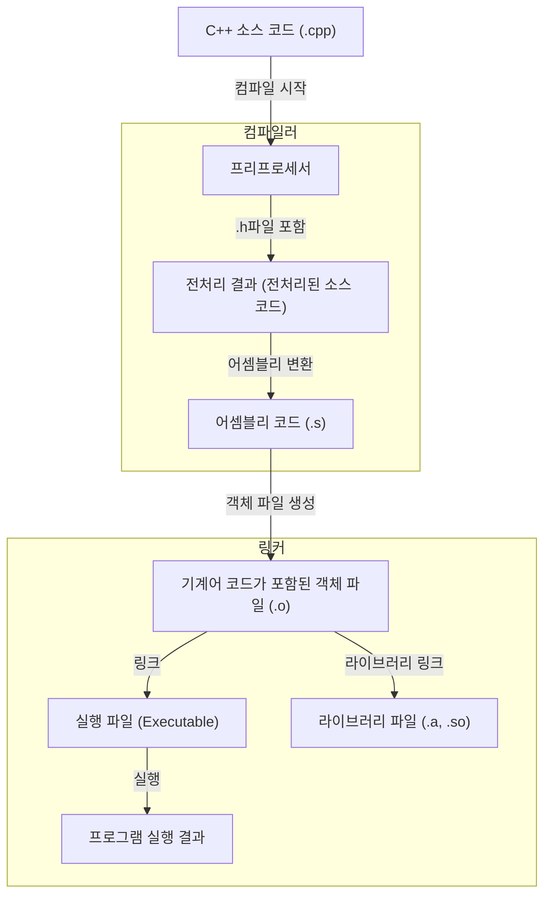

C++ 개발환경을 오랜만에 구축하면서 적절한 컴파일러 선택과 VSCode를 잘 활용하기 위한 빌드 도구와 디버거 설정에 대해 공부하고 정리하고자 합니다.
[이전 글](https://triple-trouble-devs.github.io/blog/2024/11/18/%ED%8C%A8%ED%82%B7_%ED%94%84%EB%A1%9C%EA%B7%B8%EB%9E%98%EB%B0%8D_%EA%B0%9C%EB%B0%9C%ED%99%98%EA%B2%BD_%EA%B0%80%EC%9D%B4%EB%93%9C/)과 이어지는 부분이 있어 같이 참고하시면 도움이 될 것 같습니다.

<!--more-->

## 목차

- 컴파일러 및 디버거 선택
  - GCC vs Clang
  - gdb vs lldb
- VSCode에 빌드 도구와 디버거 적용하기

## 컴파일러 및 디버거 선택

### 컴파일러 선택

C++ 코드는 바로 실행할 수 없습니다.
컴퓨터가 이해하는 기계어로 변환해야 실행할 수 있습니다.
이를 위해 컴파일러가 필요합니다.
컴파일러는 C++ 코드를 컴퓨터가 이해할 수 있는 머신 코드로 변경해주는 일을 합니다.
여러 파일의 cpp 소스 코드가 실행 파일로 변환되는 과정은 다음과 같습니다.



그림에서 첫번째 박스가 해주는 일이 컴파일러가 하는 일입니다.

#### GCC vs Clang

| 특징        | GCC                                      | Clang                            |
| ----------- | ---------------------------------------- | -------------------------------- |
| 사용 환경   | 리눅스 및 유닉스 계열에서 사용           | LLVM(macOS 기준) 프로젝트의 일부 |
| 언어 지원   | 여러 언어를 지원하는 컴파일러            | 주로 C 및 C++ 지원               |
| 안정성      | 안정적이고 오랜 역사를 가진 컴파일러     | 현대적이고 지속적으로 발전       |
| 플랫폼 지원 | 다양한 플랫폼에서 사용되는 표준 컴파일러 | 윈도우에서도 사용 가능           |
| 컴파일 속도 | Clang에 비해 느린 컴파일 속도            | 빠른 컴파일 속도                 |
| 오류 메시지 | 짧은 에러 메시지                         | 유용한 경고 메시지               |

각각의 특징을 이해하고 적합한 컴파일러를 선택하면 됩니다.
예를 들면 리눅스 환경에서 개발을 진행하고, 프로젝트 성향이 빌드 속도보다는 안정성을 중요시한다면 GCC를 선택할 수 있습니다.
또 macOS 환경에서 개발을 진행하고, 빠른 컴파일 속도와 유용한 경고 메시지를 원한다면 Clang를 선택할 수 있습니다.
C++ 환경에선 clang의 c++ 컴파일러인 clang++을 주로 사용하고, gcc의 c++ 컴파일러인 g++도 사용합니다.

### 디버거 선택

디버거는 프로그램의 오류를 찾아내는 도구입니다.
디버거는 프로그램의 실행을 중단하고, 프로그램의 상태를 확인하고, 프로그램의 실행을 제어할 수 있게 하여 오류를 찾아냅니다.
이 중에서 대표적인 디버거로 gdb와 lldb가 있습니다.

#### gdb vs lldb

| 특징          | GDB                          | LLDB                     |
| ------------- | ---------------------------- | ------------------------ |
| 개발 프로젝트 | GNU 프로젝트                 | LLVM 프로젝트            |
| 호환성        | 주로 Linux 및 UNIX 계열      | macOS 및 Linux           |
| 언어 지원     | C, C++, Fortran, Ada 등      | 주로 C, C++, Objective-C |
| 인터페이스    | 명령 줄 기반                 | 명령 줄 / GUI 지원       |
| 속도          | 비교적 느림                  | 빠름                     |
| 장점          | 저수준 디버깅, 스크립트 지원 | 오류 메시지 가독성, 통합 |
| 모듈화        | 제한적                       | 높은 모듈화              |

컴파일러 선택과 마찬가지로 디버거도 프로젝트의 성향에 맞게 선택하면 됩니다.

## VSCode에 빌드 도구와 디버거 적용하기

저는 다음의 상황을 가정하고 설명하겠습니다.
macOS 환경이고, Clang 컴파일러와 lldb 디버거를 사용하고, VSCode에 gui를 활용하여 개발을 진행하고자 합니다.

일단 VSCode 와 VSCode C/C++ Extension을 설치합니다.

- [vscode 설치](https://code.visualstudio.com/docs?dv=osx)
- [vscode C/C++ Extension 설치](https://marketplace.visualstudio.com/items?itemName=ms-vscode.cpptools)

### 프로젝트에 Clang 컴파일러 적용하기

일단 다음 명령어로 Clang이 설치돼있는지 확인합니다.

```zsh
clang --version
```

또는

```zsh
clang++ --version
```

만약 설치돼있다면 다음과 같은 결과가 나올 것입니다.

```zsh
Apple clang version 14.0.3 (clang-1403.0.29.3)
중략...
InstalledDir: /Applications/Xcode.app/Contents/Developer/Toolchains/XcodeDefault.xctoolchain/usr/bin
```

InstalledDir에 Clang이 설치된 경로가 나올 것입니다.

만약 설치돼있지 않다면 다음 명령어로 Clang을 설치합니다.
Clang과 Clang++은 Xcode Command Line Tools에 포함돼있습니다.

```zsh
xcode-select --install
```

이제 VSCode에서 간단한 .cpp 파일을 만들고 최상단에 재생 버튼을 누르면 됩니다.


버튼을 눌러 실행하면 빌드가 되고, 실행 파일이 생성됩니다.

제 경우는 tasks.json 파일을 수정하여 내 상황에 맞는 빌드 명령어를 채택하는 방식을 주로 사용하고 있습니다.

예를 들어, 모든 cpp 파일을 빌드하고 실행 파일을 luke.out으로 생성하는 명령어는 다음과 같습니다.

```json
{
  "version": "2.0.0",
  "tasks": [
    {
      "label": "build",
      "type": "shell",
      "command": "clang++",
      "args": ["-g", "*.cpp", "-o", "luke.out"]
    }
  ]
}
```

그리고 VSCode에서 `Cmd + Shift + B`를 누르면 빌드가 시작됩니다.
추가적인 tasks 설정은 [여기](https://code.visualstudio.com/docs/editor/tasks)를 참고하시면 됩니다.

### 프로젝트에 lldb 디버거 적용하기

빌드 설정이 tasks.json 파일에 적용되었다면, 디버거 설정은 launch.json 파일에 적용됩니다.

vscode는 똑똑하게도 디버거 설정을 자동으로 생성해줍니다.
하지만 직접 수정하여 내 상황에 맞게 설정할 수 있습니다.
하나의 상황을 가정하여 직접 커스텀한 launch.json 을 만들어보겠습니다.

```zsh
{
  "version": "0.2.0",
  "configurations": [
    {
      "name": "(lldb) Launch",
      "type": "lldb",
      "request": "launch",
      "program": "${workspaceFolder}/luke.out",
        "args": [],
        "stopAtEntry": false,
        "cwd": "${workspaceFolder}",
    }
    ]
}
```

이제 `F5`를 누르면 디버거가 실행되고, 디버깅을 시작할 수 있습니다.

### 마치며

컴파일러와 디버거가 무엇이고, CPP 환경에서 어떤 컴파일러와 디버거를 선택해야 하는지, VSCode에 어떻게 적용하는지에 대해 알아보았습니다.
이 글을 통해 여러분의 환경에 맞게 설정하는 데 도움이 되었으면 좋겠습니다.
감사합니다.
